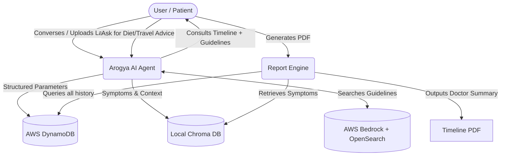

# Arogya AI - Presentation Slides Content

---

## 1. Brief about the Idea:
**Arogya AI** is a proactive, deeply contextual health companion that continuously monitors user health by intelligently extracting exactly what matters. By abstracting the complexities of medical tracking, users simply converse with the agent or upload lab reports. The agent automatically builds an exact, timestamp-aware medical timeline—logging measurable telemetry (e.g., blood pressure, glucose) into structured databases while committing nuanced conversational incidents ("I felt dizzy yesterday morning") into a local, privacy-first semantic vector memory.

**Key Differentiators:**
- **Complete Medical Memory**: Remembers medical history with exact timestamps, medical report data, and incident reports extracted smartly during natural conversations
- **Privacy-First Architecture**: All user data stored locally using ChromaDB for embeddings and DynamoDB for structured metrics
- **Hallucination-Free Medical Advice**: Grounded in authentic medical guidelines via Amazon Bedrock Knowledge Base and OpenSearch
- **Intelligent Doctor Recommendations**: Suggests nearby doctors based on current health situation and user location (IP-based)
- **Comprehensive Health Reports**: Generates downloadable PDF reports for doctor visits containing recent events, simulated condition summary, and diagnostic starting points 

---

## 2. Solution Explanation:
**● Why AI is required in your solution?**
Health isn't just numbers—it's qualitative timelines. AI acts as the smart bridge capable of extracting and separating dense numerical parameters from unstructured OCR text, while simultaneously listening to casual human conversation to catalog symptoms. Through timestamp-aware reasoning, the AI flawlessly correlates past medical data points over specific timelines, something impossible for a standard application to do organically.

**Our agentic system is uniquely capable of:**
- **Smart Extraction**: Automatically extracts measurable data from medical reports and user conversations
- **Contextual Memory**: Stores incidents and symptoms in ChromaDB vector database for easy context access
- **Timeline Reasoning**: Analyzes health data precisely across timelines with timestamp awareness
- **Natural Language Processing**: Understands user intent from casual conversation to set reminders, track symptoms, and provide advice

**● How AWS services are used within your architecture?**
- **Amazon Bedrock Knowledge Base & OpenSearch**: Hosts our definitive Medical Knowledge Base with authentic medical guidelines. By anchoring our Agent's medical reasoning strictly around AWS OpenSearch indexes of verified clinical guidelines, we ensure all advice is **100% hallucination-free** and clinically authentic.
- **Amazon DynamoDB**: Operates as our high-velocity NoSQL temporal datastore, logging precise measurable metrics from reports and user conversations, along with chronological system routines (reminders/appointments) seamlessly.
- **AWS App Runner/ECR**: Deploys our unified Docker system for resilient hosting.

**● What value the AI layer adds to the user experience?**
Unprecedented personalization and convenience:
- **Zero Manual Entry**: Just talk naturally or upload reports—the agent extracts everything automatically
- **Hyper-Personalized Advice**: Customized diet plans based on current health status, travel advice considering medical conditions
- **Natural Language Reminders**: "Remind me to take pills after 3 hours"—system automatically sets reminders
- **Privacy Guaranteed**: ChromaDB processes embeddings locally, ensuring all data stays on user's device
- **Doctor-Ready Reports**: One-click PDF generation with complete medical history for physician consultations

---

## 3. List of features offered by the solution

**Core Intelligence Features:**
- **Smart Data Extraction**: Automatically extracts measurable data from medical reports and user conversations, storing them in DynamoDB with exact timestamps
- **Conversational & Image Ingestion**: Extracts both exact numerical data from lab reports and casual conversational incidents instantly
- **Incident Tracking**: Captures and stores any health incidents conveyed during conversation in ChromaDB vector database for easy contextual retrieval

**Privacy & Data Management:**
- **Local Privacy-First Semantic Memory**: Utilizes lightweight, local ChromaDB to capture unstructured user memories (allergies, symptoms, incidents). Processing embeddings locally ensures maximum user privacy—all data stored on user's device
- **Timestamp-Aware Memory**: Complete medical history with exact timestamps for precise timeline reasoning and analysis

**Medical Guidance:**
- **Hallucination-Free Medical Advice**: Grounded strictly in authentic medical guidelines via Amazon Bedrock Knowledge Base and OpenSearch service—ensures proper, clinically accurate information
- **Hyper-Personalized Guidance**: Uses holistic gathered data to build customized diet plans ("what to eat and what not based on current health status") and situational travel advice

**Convenience Features:**
- **Natural Language Reminders**: Automatically sets pill and appointment reminders from casual chat commands ("remind me to take pills after 3 hours")
- **Geo-Aware Doctor Suggestions**: Automatically fetches user's IP-based location to recommend nearby specialized doctors based directly on current health situation

**Professional Health Reports:**
- **One-Click PDF Generation**: Generates comprehensive health reports for doctor visits containing:
  1. **Recent Events** (from memory): All incidents and symptoms shared with the system
  2. **Simulated Condition Summary**: AI analysis of what the condition could be
  3. **Diagnostic Starting Point**: Suggested areas for doctors to investigate
- **Extremely Beneficial for Doctors**: Provides complete medical timeline, helping physicians diagnose patients more accurately and efficiently

**Unlimited Use Cases:**
- Customized diet plans based on health status
- Travel advice considering medical conditions
- Medication tracking and reminders
- Symptom timeline analysis
- And many more—the possibilities are tremendous!

---

## 4. Process flow / Use-case diagram


---

## 5. Wireframes/Mock diagrams of the proposed solution
*[Visual Note for PPT: Insert 2 Screenshots here]*
1. **Mock 1**: The Gradio Chat Interface showing the user uploading a medical graph, and the bot confirming extracted numbers and setting a natural-language reminder.
2. **Mock 2**: The PDF Download button and the notification bar chiming an active pill reminder.

---

## 6. Architecture diagram of the proposed solution:
```mermaid
graph LR
    UI[Gradio Web Interface] <--> App[Python Docker Container]
    
    subgraph Data & Privacy Layer
        Dynamo[(AWS DynamoDB<br/>Metrics Engine)]
        Chroma[(Local ChromaDB<br/>Private Vector NLP)]
    end
    
    subgraph Grounding & LLM Layer
        Bedrock[(AWS Bedrock KB<br/>OpenSearch Guidelines)]
        Host[NVIDIA NIM Cloud]
        Vision[Nemotron-Vision]
        Base[Nemotron Base]
        Host --> Vision
        Host --> Base
    end
    
    App <--> Grounding & LLM Layer
    App <--> Data & Privacy Layer
    App --> Doc[Professional PDF Generator]
```

---

## 7. Technologies utilized in the solution:
- **Programming Language**: Python 3.13 
- **Agentic Framework**: Google ADK, LiteLLM
- **Cloud Database**: AWS DynamoDB (Metrics tracking)
- **Authentic Knowledge Guard**: Amazon Bedrock + OpenSearch (Clinical Index Grounding)
- **Private Vector Database**: ChromaDB (Local, high-privacy semantic embeddings)
- **Generative AI Models**: NVIDIA Nemotron (Vision & Conversation)
- **Deployment**: Docker Containerization

---

## 8. Revenue Model & Doctor Ranking Algorithm

**The platform is 100% FREE for end-users. We charge doctors, not patients.**

### Revenue Model:
- **B2B Doctor Onboarding System**: Doctors pay to be listed and featured on our platform
- **Premium Placement**: High-ranking doctors pay for better visibility to targeted patient cohorts
- **Zero Cost to Users**: Patients get all features completely free, ensuring maximum adoption and trust

### Intelligent Doctor Ranking Algorithm:

**How It Works:**
1. **Initial Recommendation**: System recommends nearby doctors based on user's current health situation and location (IP-based)
2. **Automated Follow-Up**: After user visits a recommended doctor, our system automatically requests feedback at strategic intervals:
   - **2 days** after visit
   - **1 week** after visit  
   - **1 month** after visit
3. **Continuous Health Monitoring**: System remains aware of user's health day-by-day as user reports any discomfort or improvements
4. **Outcome-Based Ranking**: System quantitatively analyzes how well the user recovered after seeing that specific doctor for that particular disease

**Ranking Factors:**
- Patient recovery rate and timeline
- Symptom improvement tracking
- User-reported comfort levels over time
- Disease-specific success rates
- Continuous health status monitoring

**Value Proposition:**
- **For Patients**: Easily identify better and skilled doctors based on real recovery data, not just reviews
- **For Doctors**: High-performing, skilled doctors are algorithmically propelled to the top based purely on authentic patient recovery data
- **Data-Driven Trust**: Rankings based on actual health outcomes, not subjective reviews
- **Elite Ecosystem**: Creates a quality-driven marketplace where skilled doctors naturally rise to the top

**Future Monetization:**
- Premium doctor profiles with enhanced visibility
- Featured placement in specific disease categories
- Access to anonymized patient cohort analytics
- Priority notification for matching patient cases

---

## 9. Snapshots of the prototype:
*[Visual Note for PPT: Insert Screenshots of:]*
- Generating the historical PDF report for a physician.
- Receiving Hallucination-free advice grounded in AWS Bedrock.
- Agent successfully tracking daily user recovery via continuous chat.

---

## 10. Prototype Performance report/Benchmarking:
- **Timeline-Aware Reporting**: Generating the highly-complex, 3-category chronological health PDF takes **< 3.5 seconds**.
- **Local Embedded Memory**: Because ChromaDB operates locally within the container, writing and querying private symptom vectors skips cloud propagation, completing in sub-50ms.
- **Vision Extraction**: Dense, multi-page lab OCR parsing occurs in ~4-6 seconds.
- **Semantic Grounding Consistency**: Achieving an immense reduction in standard LLM medical hallucinations by hard-routing all medical questions through OpenSearch guidelines.

---

## 11. Additional Details/Future Development:
- **Wearable / IoT Integration**: Connecting direct webhooks to pull Apple Health / Google Fit step counters and continuous heart-rate monitors, phasing out manual uploads for basic vitals.
- **Multi-lingual Semantic Support**: Utilizing tools like *Bhashini* to allow rural patients in India to dictate symptoms in regional languages, embedding them semantically in English, and regenerating localized reports.
- **Predictive Warning Alarms**: Training internal classifiers to detect pre-diabetic or hypertensive momentum states days before they cross clinical thresholds, warning the user autonomously.
